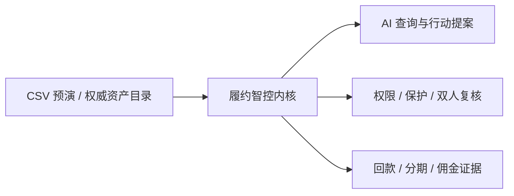
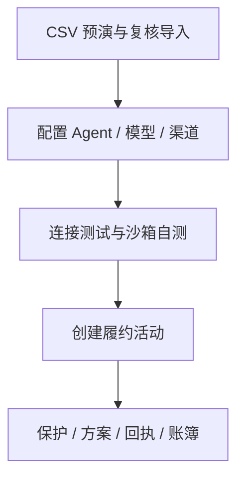
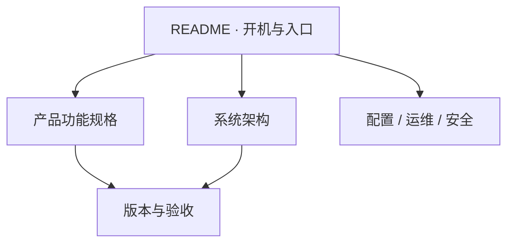

<p align="center">
  
</p>

<h1 align="center">履约智控 AI · RepayGuard AI</h1>

<p align="center"><strong>面向资产履约与回款运营的可信 AI 控制平台</strong></p>

| 当前版本 | 前端 | 业务服务 | 数据与任务 | 生产模板 |
|---|---|---|---|---|
| `v0.16.0` | React 19 + Vite 6 | FastAPI + 受控 Agent Gateway | PostgreSQL + 独立 Worker | ECS + 1Panel Compose |

> AI 负责查询、解释和生成提案；权限、策略、保护状态、双人复核与账务内核拥有最终决定权。真实外呼、支付和模型调用默认关闭。

## 一分钟理解



| 问题 | 平台怎样处理 |
|---|---|
| 哪些案件可以行动？ | 策略、授权、保护状态和渠道门禁共同预检 |
| AI 可以做什么？ | 查事实、解释原因、规划步骤、生成待审提案 |
| 谁能批准高影响操作？ | 与提案人不同的管理员 |
| 钱指标从哪里来？ | 已验签回执与不可变账簿，不读页面模拟值 |
| 业务数据怎样进入？ | CSV 先预演和逐行校验，再由另一管理员确认；不覆盖已有案件 |
| 在线页面读取什么？ | 服务端分页目录及账簿聚合；API 失败时阻断，不回退到样本 |
| 失败后怎样恢复？ | 数据库租约、Worker 心跳、重试预算和审计事件 |

## 三步开机

前置条件：Docker Engine 24+、Docker Compose v2、至少 4 GB 可用内存；端口 `4177`、`8000`、`5432` 未占用。

```bash
git clone https://github.com/IntelliPathway/luheng-fulfillops-cloud.git
cd luheng-fulfillops-cloud
docker compose up --build -d
```

确认服务：

```bash
docker compose ps
curl --fail http://localhost:8000/api/v1/health/ready
```

打开：

| 入口 | 地址 | 用途 |
|---|---|---|
| Web | <http://localhost:4177> | 产品工作台 |
| API Docs | <http://localhost:8000/api/docs> | OpenAPI 调试 |
| Readiness | <http://localhost:8000/api/v1/health/ready> | 数据库与迁移就绪 |
| Liveness | <http://localhost:8000/api/v1/health/live> | 进程存活 |

开发样本身份：

| 用户 ID | 角色 | 典型操作 |
|---|---|---|
| `Terry` | 管理员 | 默认浏览与审批 |
| `test-user` | 管理员 | 独立复核 |
| `test-operator` | 运营人员 | 创建提案 |
| `test-viewer` | 观察员 | 只读验收 |

<details>
<summary><strong>不用 Docker：本地前后端分别启动</strong></summary>

后端要求 Python 3.12：

```bash
cd backend
python3.12 -m venv .venv
.venv/bin/pip install -r requirements.txt
APP_ENV=development SEED_DEMO_DATA=true \
DATABASE_URL=sqlite:///./luheng-dev.db \
.venv/bin/uvicorn app.main:app --reload --port 8000
```

另开终端启动 Node.js 22 前端：

```bash
npm ci
npm run dev
```

</details>

## 体验主路径



1. 在“资产包”打开导入中心，使用脱敏样本或 UTF-8 CSV 生成服务端预演。
2. 由另一名管理员核对摘要和错误报告后提交；新资产包以草稿策略进入系统。
3. 在资产包和案件页确认新记录进入服务端权威目录，并使用搜索、视图、排序和分页复核。
4. 在“AI 与渠道”完成配置、连接测试、自测和管理员启用。
5. 创建履约活动，并在异常、履约计划和回款页验证保护、签约、对账及计佣。

## 运行模式

| 模式 | 权威数据 | 身份 | 外部动作 | 适用场景 |
|---|---|---|---|---|
| 前端离线演示 | 浏览器脱敏样本 | 演示身份 | 不执行 | UI 评审 |
| Docker 开发 | PostgreSQL + AMC 虚构样本 | 开发身份 | 默认关闭 | 开发与联调 |
| Sites 演示 | 浏览器脱敏样本 | 站点访问控制 | `/api/*` 返回 503 | 静态展示 |
| ECS/1Panel | PostgreSQL，不导入样本 | 企业 OIDC | 逐项启用 | 测试与生产 |

认证失败、权限不足或已连通 API 报错时，浏览器不会静默转为可写演示。

## ECS / 1Panel 门槛

| 档位 | vCPU | 内存 | 磁盘 | 结论 |
|---|---:|---:|---:|---|
| 当前目标机 | 2 | 2 GB | 40 GB | 不部署完整四容器 |
| 最低验收 | 2 | 4 GB + 2 GB Swap | 60 GB SSD | 低流量测试 |
| 推荐 | 4 | 8 GB | 100 GB SSD | 稳定测试与早期试运行 |

```bash
./scripts/ecs-capacity-check.sh /opt/1panel
```

生产模板见 [ECS + 1Panel 部署说明](deploy/1panel/README.md)。它默认使用企业 OIDC、版本化迁移、非 root 容器、私有 API/PostgreSQL，并关闭演示种子和真实 Provider。

## 工程验证

```bash
npm run verify
```

该命令依次执行 Ruff、Pytest、前端领域/API/品牌、文档链接、部署/Sites 契约测试和生产构建。GitHub Actions 另用 PostgreSQL 17 验证完整迁移链。

常用操作：

| 目标 | 命令 |
|---|---|
| 查看日志 | `docker compose logs -f api worker web` |
| 停止并保留数据 | `docker compose down` |
| 重启 | `docker compose up -d` |
| 导出单文件演示 | `python3 scripts/export-standalone.py` |

## 文档地图



| 文档 | 读者 | 一句话用途 |
|---|---|---|
| [品牌与命名](docs/brand-guide.md) | 产品、设计、研发 | 中英文名、Logo、语气与使用规则 |
| [产品功能规格](docs/product-functional-spec.md) | 产品、研发、测试、交付 | 能力地图、角色、流程、规则和验收 |
| [系统架构](docs/architecture.md) | 架构、研发、运维 | 服务、数据、信任边界与技术债 |
| [配置参考](docs/configuration.md) | 研发、运维 | 全部环境变量及生产约束 |
| [运维手册](docs/operations-runbook.md) | 运维、交付 | 启停、发布、备份和故障处置 |
| [安全策略](SECURITY.md) | 安全、研发 | 密钥、认证、隔离和上线检查 |
| [贡献指南](CONTRIBUTING.md) | 开发者 | 代码风格、测试和提交标准 |
| [v0.16 发布说明](RELEASE_v0.16.0.md) | 发布与验收 | 服务端权威资产目录 |

## 当前边界

- 浏览器通用 OIDC Authorization Code + PKCE 仍需按最终企业 IdP 落地。
- 语音、电话和 Hermes Provider 仍以确定性沙箱适配为主。
- 支付沙箱默认关闭，不连接真实收单机构或银行。
- 真实模型调用需部署开关、租户密钥、出网白名单、自测和管理员确认。
- 仓库名、环境变量前缀、Webhook 头和 `fulfillops-safe` 等技术标识暂时保留，避免破坏现有集成；它们不是对外产品名。

项目为私有业务代码仓库，尚未发布开源许可证。
