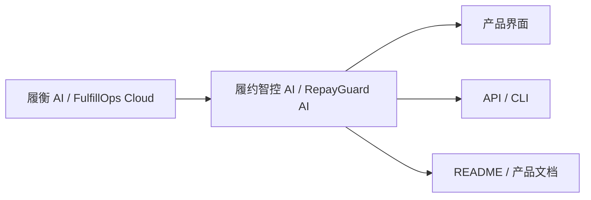

# 履约智控 AI · RepayGuard AI v0.14.0

| 项目 | 结果 |
|---|---|
| 发布类型 | 品牌、信息架构与文档体验升级 |
| 日期 | 2026-09-15 |
| 数据库迁移 | 无 |
| API 破坏性变化 | 无 |
| 部署目标 | Docker 开发 / ECS + 1Panel |

## 可见变化

| 变化 | 说明 |
|---|---|
| 中文名 | “履约智控 AI”直接表达履约运营与受控智能 |
| 英文名 | “RepayGuard AI”表达回款推进与治理边界 |
| Logo | 三个神经节点 + 开放控制环 + 向前路径 |
| 功能名称 | “清收活动”调整为“履约活动” |
| README | 以图、表、三步启动和部署门槛为主 |
| 产品规格 | 能力图、角色矩阵、状态机、规则表、验收表 |

## 品牌边界

新名称用于当前 UI、API 标题、CLI 描述和稳定文档。以下技术标识为了兼容性继续保留：

- GitHub 仓库与包名 `luheng-fulfillops-cloud`；
- Docker 镜像名 `luheng-fulfillops-*`；
- `X-FulfillOps-*` Webhook 头；
- `FULFILLOPS_*` 环境变量；
- `fulfillops-safe` Agent 工具命名空间；
- 历史发布说明和迁移注释。

这些标识只有在提供映射、迁移、回滚和集成测试后才可修改。

## 质量门禁

| 验证 | 结果 |
|---|---|
| 品牌契约 | 中文名、英文名、Logo、版本与部署镜像对齐 |
| 前端领域/API/品牌 | 24 项通过 |
| 文档结构与链接 | 3 项通过 |
| 部署与 Sites | 6 项通过 |
| 后端 Pytest / Ruff | 89 项通过，1 项 PostgreSQL 专项本地跳过 |
| Vite 生产构建 | 已通过 |
| 业务 HTTP 冒烟 | 财务、对账、保护、履约 4 条通过 |
| 运行入口 | Web 标题、Logo PNG、API/OpenAPI 名称与 `0.14.0` 通过 |
| 单文件演示 | `export/RepayGuardAI_Interactive.html` 已生成并校验 |
| PostgreSQL 17 CI | 以发布提交的 GitHub Check 为准 |

## 已知限制

- 云端浏览器策略阻止本机回环预览，本轮不声称新增页面截图验收；
- 英文名已做快速公开检索，但正式商业使用前仍需专业商标、域名和近似图形检索；
- 当前目标 ECS 为 2C2G/40G，仍低于完整四容器栈最低门槛。
