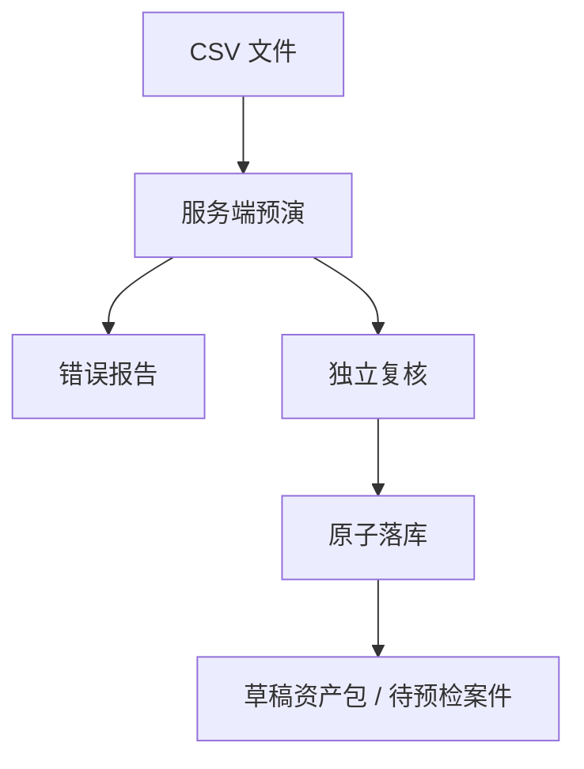
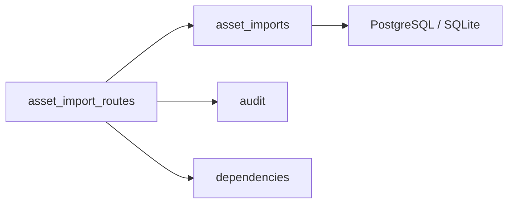

# 履约智控 AI · RepayGuard AI v0.15.0

## 发布卡片

| 项目 | 结果 |
|---|---|
| 主题 | 资产与案件批量导入闭环 |
| 数据边界 | UTF-8 CSV，1 MB / 1000 行，白名单字段 |
| 审批 | 创建人与确认人分离 |
| 数据库 | PostgreSQL 第 12 段迁移 |
| 部署 | ECS / 1Panel 模板保持兼容，当前目标机仍不部署 |

## 业务流程

## 功能增量

| 能力 | 行为 |
|---|---|
| 文件预演 | 解析表头、逐行校验、生成 SHA-256 和结构化问题 |
| 隐私约束 | PII 表头和未知字段整批阻断；不保存原始 CSV |
| 业务校验 | 整数分、日期、委托有效期、状态、规则和证据引用 |
| 重复保护 | 文件内重复报错；库内已有案件跳过且不覆盖 |
| 幂等 | 同租户同键同文件返回原批次；异文件返回 409 |
| Maker–Checker | 另一管理员确认，版本陈旧或自审失败关闭 |
| 原子提交 | 资产包、规则、案件、财务档案、批次与审计一起提交 |
| 前端工作台 | 文件选择、脱敏样本、预演指标、问题下载、历史批次和确认 |

## 架构整理

- 导入领域采用独立 Router 和应用服务，没有继续膨胀 `main.py`。
- 请求上下文、数据库依赖和审计帮助器成为可复用模块。
- 新增来源批次字段，但保留旧案件与资产包兼容性。

## 验收矩阵

| 验收项 | 本地结果 | CI 结果 |
|---|---:|---:|
| 后端 | 98 通过，1 个 PostgreSQL 专项本地跳过 | PostgreSQL 17 执行全部 99 项 |
| 前端领域/API/品牌 | 25 项 | 同套执行 |
| 文档 | 3 项 | 同套执行 |
| 部署与 Sites | 6 项 | 同套执行 |
| v0.9–v0.12 冒烟 | 4 条 | 同套执行 |
| v0.15 导入冒烟 | 预演、自审阻断、幂等、原子落库 | 同套执行 |
| Vite 构建 | 通过 | 同套执行 |

## 安全结论

- Agent 没有导入写工具，不能绕过人工复核。
- CSV 原文、姓名、号码、证件、地址和邮箱不进入数据库或审计。
- 新资产包默认草稿，导入成功不等于允许触达。
- Sites 仍只是前端沙箱；真实数据导入只允许连接受控业务 API。

## 已知边界

- 本版单批同步预演上限为 1000 行；大文件分片与对象存储隔离扫描尚未实现。
- 当前前端只展示批次结果；完整服务端资产清单查询仍是后续数据主权收口项。
- ECS 当前为 2C2G / 40G，仍低于 2C4G / 60G 最低门槛，本版不执行部署。
