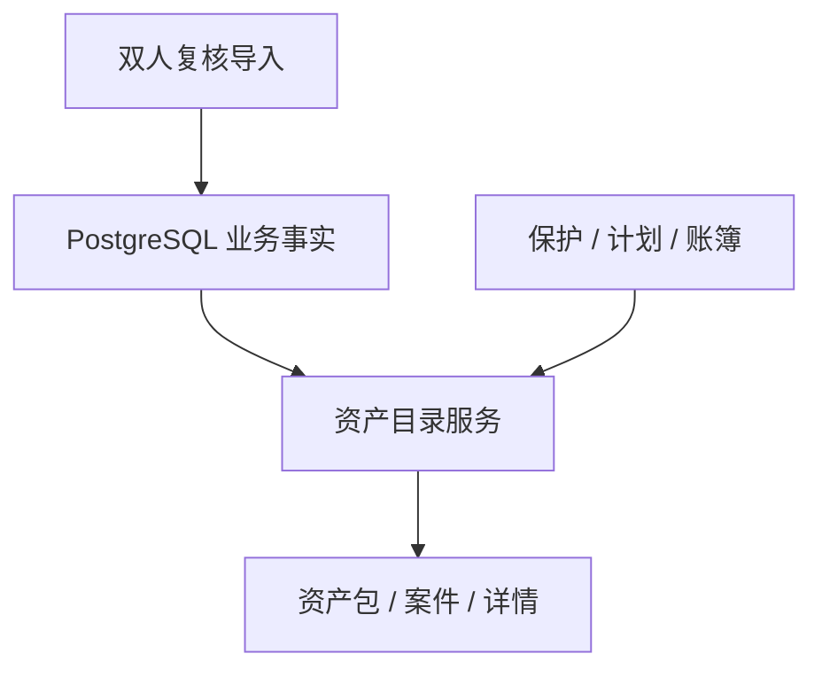

# 履约智控 AI · RepayGuard AI v0.16.0

## 发布卡片

| 项目 | 结果 |
|---|---|
| 主题 | 服务端权威资产目录 |
| 核心变化 | 在线资产包、案件与详情不再读取浏览器样本 |
| 查询能力 | 搜索、视图、排序、分页、分面计数 |
| 数据库 | 沿用 PostgreSQL 12 段迁移，无新增表结构 |
| 部署 | ECS / 1Panel 模板保持兼容；当前目标机仍不部署 |

## 数据流

## 功能矩阵

| 能力 | 结果 |
|---|---|
| 资产包目录 | 策略、案件数、基础资格池、保护数、完整度、债权与回款聚合 |
| 案件目录 | 编号/资产包/状态搜索，已签/保护/低完整度视图 |
| 排序分页 | 编号、最新入库、债权余额；最大每页 100 条 |
| 单案详情 | 债权、委托、佣金规则、来源批次、保护、计划和资金摘要 |
| 导入衔接 | 确认后的草稿资产包与案件立即出现在目录 |
| 缺失事实 | 返回 `null` / “未接入”，不使用样本推断 |
| 在线失败 | 显示错误并停止，不回退到前端业务样本 |

“基础资格池”只统计策略已发布、余额有效、委托已生效、佣金规则有效且有联系依据的未完成案件；创建活动时仍会按目标和在途状态重新预检。

## 安全边界

- 所有目录查询绑定数据库成员对应的 `tenant_id`。
- 跨租户单案读取返回 404，不泄露记录是否存在。
- 查询值参数化，LIKE 通配符显式转义。
- API 不返回姓名、电话、证件、地址、邮箱或原始 CSV。
- 在线策略只读；没有服务端治理接口时浏览器不能模拟发布。
- 新导入资产包保持草稿，不能直接创建生产活动。
- 活动预检重新核验债权余额、委托期、有效佣金规则和联系依据，未来委托不会提前进入生产执行。

## 验收矩阵

| 验收项 | 发布候选 |
|---|---:|
| 后端 | 107 通过，1 个 PostgreSQL 专项本地跳过 |
| 前端领域/API/品牌 | 27 项 |
| 文档 | 3 项 |
| 部署与 Sites | 6 项 |
| 业务 HTTP 冒烟 | 6 条 |
| PostgreSQL 迁移 | CI 执行完整 12 段迁移 |
| Vite 构建 | 通过 |

## 已知边界

- 工作台总览和全局快捷搜索预载当前租户前 100 个案件；完整结果在案件页按服务端分页读取。
- 债务账龄、最近联络时间和债务本金/息费拆分尚未纳入服务端数据模型，本版明确显示未接入。
- 策略在线写入尚未形成独立 Maker–Checker 工作流，因此 v0.16 只展示权威策略快照。
- ECS 当前为 2C2G / 40G，低于 2C4G / 60G 最低门槛，不执行部署。
