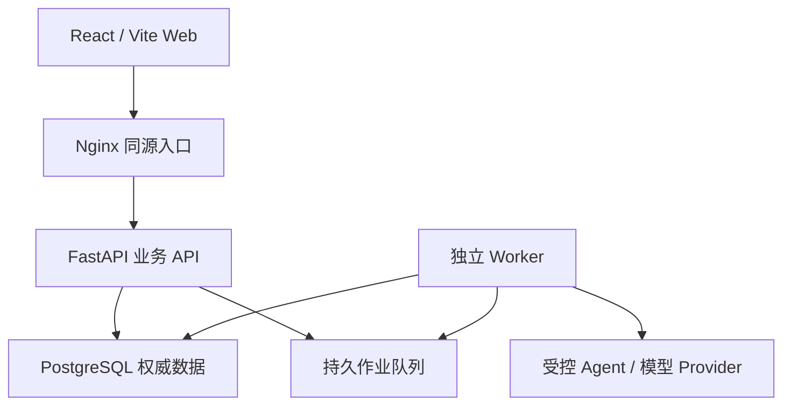

# 系统架构

## 1. 架构目标

履衡 AI 采用“结构化运营台 + 全局对话入口 + 活动内 Agent”的产品形态。系统的核心原则不是让模型直接执行业务，而是让模型负责查询、解释、规划和生成提案，由确定性策略、状态机、权限和账务内核作最终裁决。

## 2. 运行拓扑

生产环境只有 Nginx 经 1Panel HTTPS 反向代理对外。API 与 PostgreSQL 只存在于 Compose 内部网络；Worker 没有入站端口。

## 3. 代码地图

| 路径 | 职责 |
|---|---|
| `src/` | React 工作台、离线演示适配、API 客户端与业务交互 |
| `backend/app/main.py` | FastAPI 装配和现有路由；当前仍是待拆分的组合根 |
| `backend/app/config.py` | 启动配置解析和生产失败关闭规则 |
| `backend/app/bootstrap.py` | 数据库迁移、开发建表和可选演示种子编排 |
| `backend/app/provision.py` | 首租户/成员的幂等身份初始化 |
| `backend/app/security.py` | 开发 JWT、OIDC/JWKS、租户成员身份和 Runtime Grant |
| `backend/app/job_queue.py` | 带租约、心跳、fencing 和恢复预算的作业队列 |
| `backend/app/worker.py` | 独立作业执行进程 |
| `backend/app/agent_gateway.py` | Agent 会话、受控工具和高影响动作提案 |
| `backend/app/model_gateway.py` | 模型出网、端点、Token、费用和 JSON 契约门禁 |
| `backend/app/financial_ledger.py` | 回执验签、幂等、回款/佣金账簿和对账 |
| `backend/app/protection_workflow.py` | 保护事件、证据和 Maker–Checker 处置 |
| `backend/app/repayment_plans.py` | 签约方案、期次、回款分摊和退款逆冲 |
| `backend/migrations/` | PostgreSQL 唯一生产表结构演进来源 |
| `worker/` | Sites 静态演示 Worker；不承载业务 API |
| `deploy/1panel/` | ECS/1Panel 生产 Compose、Nginx 和操作说明 |

## 4. 请求与身份边界

1. Web 通过同源 `/api/v1` 访问 API。
2. 生产请求使用 Bearer OIDC JWT；API 验证算法白名单、签名、issuer、audience 和时间声明。
3. `X-Tenant-ID` 是显式工作空间范围；可选 IdP 租户声明只能进一步缩小范围。
4. 用户角色只从数据库 `tenant_memberships` 解析，Token 中的角色不能覆盖数据库权限。
5. `X-Actor-ID` 仅允许开发环境使用；生产启动门禁要求关闭。

## 5. 数据权威性

| 数据 | 权威来源 | 禁止方式 |
|---|---|---|
| 租户、用户、角色 | PostgreSQL 成员关系 | 浏览器自报角色 |
| 服务配置与版本 | 服务端配置表 + 密钥引用 | 浏览器保存明文密钥 |
| 活动与执行状态 | 服务端预检和 Agent 运行 | 聊天直接启动触达 |
| 回款与佣金 | 已验签回执 + 不可变账簿 | 页面直接改金额 |
| 保护状态 | 保护事件状态机 | 普通恢复按钮解除 |
| 履约方案与期次 | 已复核方案 + 回款分摊 | 前端硬编码余额 |
| Agent 结论 | 会话、工具轨迹、证据摘要 | 把模型文本当事实 |

所有金额使用整数分。原始支付请求体、支付签名、原始模型提示词、模型正文和 Provider 密钥不写入数据库。

## 6. 持久作业

API 在 `external` 模式只负责入队，Worker 通过数据库租约领取任务。PostgreSQL 使用 `SKIP LOCKED`；通知 Broker 只负责低延迟唤醒，数据库轮询始终是恢复路径。Worker 崩溃后，过期租约会在最大尝试次数内重新排队；旧 Worker 的终态写入由租约 fencing 阻止。

## 7. Agent 与模型隔离

Agent Gateway 只开放租户范围内查询和活动暂停/恢复提案等受控工具。Shell、任意文件系统、任意 HTTP、直接改账、解除保护和策略发布均不在工具授权内。

模型 Gateway 默认 `contract-only`。真实模型必须同时满足部署开关、HTTPS 出网白名单、允许模型、租户密钥、连接测试、Token/费用上限和管理员确认。真实安全回放只发送合成或脱敏断言摘要，最多调用一次且不自动重试。

## 8. 数据库演进

- PostgreSQL：只使用 `backend/migrations/` 中的顺序 SQL 文件和 `schema_migrations` 记录。
- 生产：`AUTO_CREATE_SCHEMA=false`，严禁 SQLAlchemy `create_all` 修补生产结构。
- SQLite：仅用于零依赖开发/测试，可以使用 ORM 建表和兼容列升级。
- 演示种子：仅在 `SEED_DEMO_DATA=true` 时导入；若数据库已存在非演示租户，导入会失败关闭。

## 9. 构建与供应链

- Python/Node 直接依赖固定在项目清单与 lock 文件中。
- CI 执行 Ruff lint/format、Pytest、Node 契约测试、Vite 构建和 PostgreSQL 迁移。
- API 与 Worker 镜像以非 root UID `10001` 运行，并在生产 Compose 中使用只读根文件系统。
- 前端构建将 React、Phosphor 图标和业务代码拆包，避免单一超大入口包。

## 10. 已知技术债

1. `backend/app/main.py` 仍聚合大量路由，后续应按 integrations、agents、payments、protections、repayment 等领域拆成 Router 与应用服务。
2. `src/App.jsx` 仍承担过多状态和在线/离线编排，后续应拆为领域 Store、查询层和 Online/Demo Adapter。
3. 数据库仍有一部分跨租户关联只由应用层校验，后续应补复合外键和 Check Constraint。
4. 列表 API 尚未统一游标分页；财务聚合仍需进一步下推数据库。
5. 尚缺完整浏览器 E2E、可访问性、覆盖率阈值、SAST、容器扫描和 SBOM。
6. 通用浏览器 OIDC Authorization Code + PKCE 流程需要按最终企业 IdP 落地。

上述项目不能通过 README 宣称为已完成能力；每项完成时需要测试、迁移或 ADR 证据。
