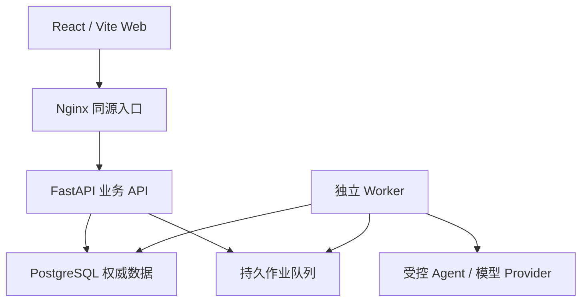

# 履约智控 AI · RepayGuard AI 系统架构

## 1. 架构目标

履约智控 AI（RepayGuard AI）采用“结构化运营台 + 全局对话入口 + 活动内 Agent”的产品形态。系统的核心原则不是让模型直接执行业务，而是让模型负责查询、解释、规划和生成提案，由确定性策略、状态机、权限和账务内核作最终裁决。

## 2. 运行拓扑

```mermaid
flowchart TB
    Browser["React / Vite Web"] --> Nginx["Nginx 同源入口"]
    Nginx --> API["FastAPI 业务 API"]
    API --> PG["PostgreSQL 权威数据"]
    API --> Queue["持久作业队列"]
    Worker["独立 Worker"] --> Queue
    Worker --> PG
    Worker --> Providers["受控 Agent / 模型 Provider"]
```

生产环境只有 Nginx 经 1Panel HTTPS 反向代理对外。API 与 PostgreSQL 只存在于 Compose 内部网络；Worker 没有入站端口。

## 3. 代码地图

| 路径 | 职责 |
|---|---|
| `src/` | React 工作台、离线演示适配、API 客户端与业务交互 |
| `backend/app/main.py` | FastAPI 装配和现有路由；当前仍是待拆分的组合根 |
| `backend/app/asset_import_routes.py` | 导入领域 Router、角色与 HTTP 边界 |
| `backend/app/asset_imports.py` | CSV 契约、预演、幂等与原子提交应用服务 |
| `backend/app/asset_catalog_routes.py` | 资产包/案件查询参数、响应与 HTTP 边界 |
| `backend/app/asset_catalog.py` | 权威目录、分页、分面、完整度与账簿聚合 |
| `backend/app/dependencies.py` | 跨 Router 共享的请求上下文和数据库依赖 |
| `backend/app/audit.py` | 统一的非敏感审计事件写入 |
| `backend/app/config.py` | 启动配置解析和生产失败关闭规则 |
| `backend/app/bootstrap.py` | 数据库迁移、开发建表和可选演示种子编排 |
| `backend/app/provision.py` | 首租户/成员的幂等身份初始化 |
| `backend/app/security.py` | 开发 JWT、OIDC/JWKS、租户成员身份和 Runtime Grant |
| `backend/app/job_queue.py` | 带租约、心跳、fencing 和恢复预算的作业队列 |
| `backend/app/worker.py` | 独立作业执行进程 |
| `backend/app/agent_gateway.py` | Agent 会话、受控工具和高影响动作提案 |
| `backend/app/model_gateway.py` | 模型出网、端点、Token、费用和 JSON 契约门禁 |
| `backend/app/financial_ledger.py` | 回执验签、幂等、回款/佣金账簿和对账 |
| `backend/app/protection_workflow.py` | 保护事件、证据和 Maker–Checker 处置 |
| `backend/app/repayment_plans.py` | 签约方案、期次、回款分摊和退款逆冲 |
| `backend/migrations/` | PostgreSQL 唯一生产表结构演进来源 |
| `worker/` | Sites 静态演示 Worker；不承载业务 API |
| `deploy/1panel/` | ECS/1Panel 生产 Compose、Nginx 和操作说明 |

## 4. 请求与身份边界

1. Web 通过同源 `/api/v1` 访问 API。
2. 生产请求使用 Bearer OIDC JWT；API 验证算法白名单、签名、issuer、audience 和时间声明。
3. `X-Tenant-ID` 是显式工作空间范围；可选 IdP 租户声明只能进一步缩小范围。
4. 用户角色只从数据库 `tenant_memberships` 解析，Token 中的角色不能覆盖数据库权限。
5. `X-Actor-ID` 仅允许开发环境使用；生产启动门禁要求关闭。

## 5. 数据权威性

| 数据 | 权威来源 | 禁止方式 |
|---|---|---|
| 租户、用户、角色 | PostgreSQL 成员关系 | 浏览器自报角色 |
| 导入批次与案件来源 | 文件摘要 + 标准化白名单字段 | 保存原始 CSV、PII 或覆盖已有案件 |
| 资产包与案件列表 | PostgreSQL 目录查询 + 账簿聚合 | 在线模式读取浏览器 JSON 样本 |
| 服务配置与版本 | 服务端配置表 + 密钥引用 | 浏览器保存明文密钥 |
| 活动与执行状态 | 服务端预检和 Agent 运行 | 聊天直接启动触达 |
| 回款与佣金 | 已验签回执 + 不可变账簿 | 页面直接改金额 |
| 保护状态 | 保护事件状态机 | 普通恢复按钮解除 |
| 履约方案与期次 | 已复核方案 + 回款分摊 | 前端硬编码余额 |
| Agent 结论 | 会话、工具轨迹、证据摘要 | 把模型文本当事实 |

所有金额使用整数分。原始支付请求体、支付签名、原始模型提示词、模型正文和 Provider 密钥不写入数据库。

## 6. 持久作业

API 在 `external` 模式只负责入队，Worker 通过数据库租约领取任务。PostgreSQL 使用 `SKIP LOCKED`；通知 Broker 只负责低延迟唤醒，数据库轮询始终是恢复路径。Worker 崩溃后，过期租约会在最大尝试次数内重新排队；旧 Worker 的终态写入由租约 fencing 阻止。

## 7. Agent 与模型隔离

Agent Gateway 只开放租户范围内查询和活动暂停/恢复提案等受控工具。Shell、任意文件系统、任意 HTTP、直接改账、解除保护和策略发布均不在工具授权内。

模型 Gateway 默认 `contract-only`。真实模型必须同时满足部署开关、HTTPS 出网白名单、允许模型、租户密钥、连接测试、Token/费用上限和管理员确认。真实安全回放只发送合成或脱敏断言摘要，最多调用一次且不自动重试。

## 8. 数据库演进

- PostgreSQL：只使用 `backend/migrations/` 中的顺序 SQL 文件和 `schema_migrations` 记录。
- 生产：`AUTO_CREATE_SCHEMA=false`，严禁 SQLAlchemy `create_all` 修补生产结构。
- SQLite：仅用于零依赖开发/测试，可以使用 ORM 建表和兼容列升级。
- 演示种子：仅在 `SEED_DEMO_DATA=true` 时导入；若数据库已存在非演示租户，导入会失败关闭。

## 9. 构建与供应链

- Python/Node 直接依赖固定在项目清单与 lock 文件中。
- CI 执行 Ruff lint/format、Pytest、Node 契约测试、Vite 构建和 PostgreSQL 迁移。
- API 与 Worker 镜像以非 root UID `10001` 运行，并在生产 Compose 中使用只读根文件系统。
- 前端构建将 React、Phosphor 图标和业务代码拆包，避免单一超大入口包。

## 10. 已知技术债

1. `backend/app/main.py` 仍聚合大量旧路由；v0.15–v0.16 已拆出 asset-import、asset-catalog、依赖与审计模块，后续继续按 integrations、agents、payments、protections、repayment 领域迁移。
2. `src/App.jsx` 仍承担过多状态和在线/离线编排；v0.16 已把目录查询独立到 API 层，后续应继续拆为领域 Store 和 Online/Demo Adapter。
3. v1.0–v1.3 已补齐主链路租户复合外键与 Check Constraint；新增领域必须继续遵守同一约束模式。
4. v1.4 已将财务摘要下推数据库，v1.5 已为案件目录增加游标分页；其他大列表仍需渐进迁移。
5. SBOM、CodeQL SAST 与容器扫描已进入 CI；仍缺完整浏览器 E2E、可访问性和覆盖率阈值。
6. 通用浏览器 OIDC Authorization Code + PKCE 已完成，仍需按最终企业 IdP 进行 E2E 联调。

上述项目不能通过 README 宣称为已完成能力；每项完成时需要测试、迁移或 ADR 证据。

## 企业接入与身份拓扑（v5.0）

浏览器先通过 OIDC 授权码 + PKCE 登录，再以有效成员关系发现企业。API 对每次请求校验 issuer、audience、签名与数据库成员；令牌租户声明只能进一步收窄范围。身份服务可用现有 IdP 或独立 Keycloak + PostgreSQL，Sites 不承载该身份数据库。企业 CLI 原子写企业、成员、套餐和审计，生命周期激活仍走独立审批。接入向导读取当前集成报告与独立导入批次，不把材料数量当验收。实现入口和标准见 [企业接入](enterprise-onboarding.md)。

## 标准贷款机催模块（2026-10-07 开发增量）

新增 `loan_routes.py`、`loan_collection.py`、`loan_models.py`、`loan_policy.py`：与现有案件和租户关联，资料、沙箱会话和事件分别保存；金额和授权由确定性服务检查，PTP 是会话中的独立承诺数据，不能冒充正式 RepaymentPlan。事件幂等及会话版本校验在同一案件写锁内完成。资料更新使旧会话停止动作。

`loan.promise_check` 复用租约队列执行到期核验，只读取现有不可变净回款账本；不会写回款或把承诺兑现当作债务结清。真实渠道与核验适配器缺失时 fail closed。联系任务先取得案件写锁再计数，避免同案并发突破共享日限额；电话回执不能覆盖保护/终态或回退事件阶段。

规划和当前能力边界见 [MVP 计划](standard-loan-machine-collection-mvp.md)。

沙箱执行授权绑定既有会话的租户、案件、模式、资料版本及授权管理员，并保存 authorization_expires_at（UTC，创建后最多 30 分钟，由租户政策收窄且不晚于政策到期）。每次新事件先复核期限、当前管理员成员关系及租户生命周期，失效则持久暂停且不新增债务披露。事件幂等重放返回历史结果，不续期、不重新执行。已到期对话可用新 request_key 重新批准；待兑现 PTP 和自述已还款仍独立阻止重复联系。

租户政策保存在 loan_contact_policies；管理员确认并以 expected_version 更新，版本只增不回退。会话冻结政策版本和 JSON 快照；政策更新不覆盖旧快照，每次新事件对当前政策复核，变化、暂停、到期或超出时段会暂停。政策更新、会话准入及新事件统一先锁租户再锁案件，在 PostgreSQL/SQLite 路径串行化；当前保守租户锁用于沙箱，尚未实现真实 Provider 配额预占。PTP 查账不受联系时段/政策暂停影响，但仍复核任务提交人和资料。

### 标准贷款电话适配契约
`loan_telephony.py` 定义内部测试派发、按键查询及单调回执裁决；尚未接入 Worker/API/持久化，真实模式继续阻断。超时结果视为 unknown，查询无结果不能自动重新派发。Linphone 作为 SIP 接听端，服务端仍需 SIP/PBX、媒体桥与受控语音模型。详细状态、外部依赖和验收见标准个贷 MVP 计划。

## SIP 电话联调增量

`backend/app/sip_lab.py` 是部署主机侧独立工具，不连接案件、LoanSession、业务账本或 Agent。本机 ARI → Asterisk → Linphone 1001，接听后运行 1000 回声拨号计划。独立 SQLite 意图日志先预留再 POST，固定 channel ID；同键仅 GET，超时、409、崩溃及 404 均不自动重拨。该日志不是正式 Provider 事件证据；后续仍须接租户授权、真实配额、业务事件及媒体桥。现有渠道测试只验沙箱契约，live 摘要不再冒充投递成功，历史 live tested/enabled 视图阻断。

标准贷款新增持久 loan.dispatch_check 作业，复用队列租约与恢复；执行时重查当前授权及资料/政策/会话状态。仅输出门禁检查结果，不接网络、不预占真实联系配额，也不作为后续拨号授权。详见 MVP 计划。
