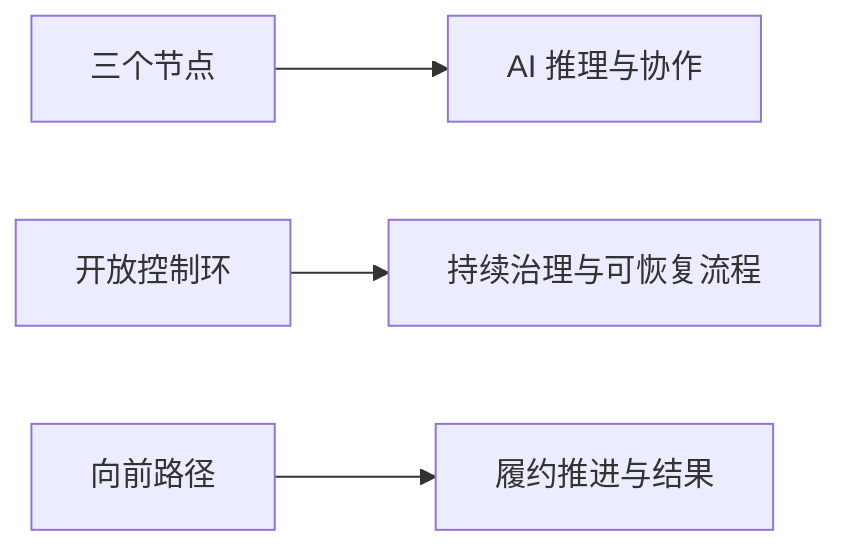

# 品牌与命名

  

<h2 align="center">履约智控 AI · RepayGuard AI</h2>

资产回款运营平台

## 命名体系

| 层级 | 名称 | 使用位置 |
|---|---|---|
| 中文产品名 | **履约智控 AI** | 中文 UI、方案、汇报与客户沟通 |
| 英文产品名 | **RepayGuard AI** | 英文材料、国际化界面与品牌锁定 |
| 品类描述 | **资产回款运营平台** | 首屏副标题、文档封面、销售说明 |
| 技术兼容名 | `luheng-fulfillops-cloud` / `fulfillops-safe` | 仓库、环境变量、协议与迁移路径 |

技术兼容名不作为对外品牌；在没有迁移计划前不得批量重命名，避免破坏镜像、Webhook、密钥引用和现有部署。

## Logo 语义

| 元素 | 含义 |
|---|---|
| 三个连接节点 | AI 基于事实、工具和规则形成判断 |
| 开放圆环 | 流程持续运行，但每一步受边界控制 |
| 上行路径 | 从案件行动推进到可核验回款结果 |
| 蓝色 | 可信、稳定、企业级控制 |
| 青绿色 | 已验证、可推进、正向结果 |

## 标准组合

| 场景 | 组合 |
|---|---|
| 中文产品 | `[Logo] 履约智控 AI` |
| 双语产品 | `[Logo] 履约智控 AI · RepayGuard AI` |
| 完整封面 | 中文名 + 英文名 + “资产回款运营平台” |
| 小尺寸 | 仅 Logo；不得塞入产品全称 |

## 视觉规则

| 项目 | 规范 |
|---|---|
| 主色 | `#315EFB` |
| 辅色 | `#25B7A6` |
| 背景 | 白色、浅灰或现有深色 Agent 界面 |
| 最小显示 | 建议不低于 24 px |
| 安全留白 | 至少为标志中单个节点直径 |
| 字体 | Inter / Noto Sans SC，与现有工作台一致 |

不要拉伸、旋转、添加阴影、叠加复杂背景、重绘节点比例或把 Logo 当装饰纹样。

## 产品语气

| 应该表达 | 避免表达 |
|---|---|
| 受控 AI、来源清楚、边界明确 | 万能 AI、完全自主 |
| 提案、复核、证据、可恢复 | 自动保证回款 |
| 保护优先、失败关闭 | 绕过人工与合规 |
| 已验签、已匹配、已入账 | 页面按钮等于到账 |

## 资产

- 主标志：[repayguard-ai-mark.png](../public/assets/repayguard-ai-mark.png)
- 浏览器图标：复用主标志，由 `index.html` 引用。
- UI 品牌常量：`src/brand.js`。

当前标志为本项目原创生成资产。对外注册或商业发布前仍应完成正式商标、域名和近似图形检索。
