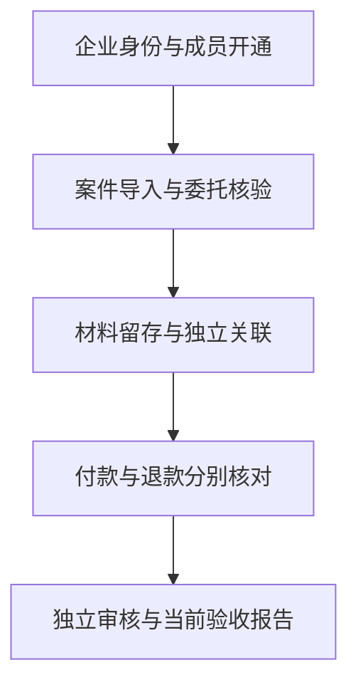

# 企业标准接入 · v5.0

当前代码支持首家内部企业和后续企业使用同一接入流程。Sites 发布的是前端；API、PostgreSQL、Worker 和企业身份服务需部署到企业运行环境。部署模板完成不等于服务器已经启动；合成验证不等于真实客户验收。

## 接入流程



| 阶段 | 操作 | 完成依据 |
|---|---|---|
| 身份 | 企业 OIDC 登录，登记实际 `sub` | 两名不同有效管理员，成员关系在数据库中 |
| 开通 | `app.enterprise_cli` 原子初始化 | 企业、成员、套餐及审计共同提交；冲突全部回滚 |
| 案件 | CSV 预演，另一管理员提交 | 当前租户已提交的独立审核批次；委托和策略另行验证 |
| 材料 | 加密上传、字段映射、关联复核 | 原件及最新版本可追溯；上传金额仍是来源声明 |
| 金额 | 分别核对付款和退款 | 已验签回执、不可变账簿与外部声明一致；无退款填 0 |
| 验收 | 外部记录、独立审批、重新生成报告 | 当前配置和证据未过期；完整生产与业务门禁满足 |

`GET /api/v1/auth/workspaces` 从当前身份的有效成员关系发现企业，并与可选 OIDC 租户声明取交集。令牌中的角色不能替代数据库授权。`GET /api/v1/enterprise/onboarding` 按当前租户读取新鲜进度；页面刷新失败清除旧证据。

## 1. 生成部署配置包

从仓库根目录运行，使用实际 HTTPS 来源：

```bash
python scripts/enterprise-config.py \
  --site-origin https://app.example.com \
  --api-origin https://api.example.com \
  --identity-origin https://login.example.com \
  --output /opt/repayguard/enterprise-config
```

输出 `runtime-config.json`、`backend-public.env`、`repayguard-realm.json` 和 `nginx.conf`。文件不包含密码或密钥；已存在输出会拒绝覆盖。Realm 使用公开客户端、授权码 + PKCE S256、精确回调来源、API audience；不创建用户。配置后端时合并公开变量与独立注入的数据库、加密及运行时密钥。

## 2. 企业身份服务

可以接现有企业 IdP，也可以使用 [自托管身份服务](../deploy/identity/README.md)。自托管模板采用 Keycloak 和独立 PostgreSQL。两个审核账号必须属于两个独立人员；在身份管理端创建账号并取得实际 `sub`，不要使用模板占位值。角色权限由平台成员关系管理。

## 3. 原子开通首家与第二家企业

复制 [成员清单](../public/standards/enterprise-manifest.json)，替换企业标识、实际 `subject`、邮箱及显示名。管理员少于两位、重复身份/邮箱、无效角色、超套餐席位、占位身份均拒绝。再次执行相同配置是幂等操作；已停用成员和用户不会被恢复，套餐冲突须走治理流程。

```bash
cd backend
python -m app.enterprise_cli --manifest /secure/internal-001.json --validate-only
python -m app.enterprise_cli --manifest /secure/internal-001.json
python -m app.enterprise_cli --manifest /secure/customer-002.json
```

Compose 部署可先 `docker compose cp /secure/internal-001.json api:/tmp/enterprise.json`，再 `docker compose exec api python -m app.enterprise_cli --manifest /tmp/enterprise.json`；两条命令均带部署时使用的 `--env-file` 和 `-f` 参数。清单不包含密码，但包含成员个人信息，不放入公开仓库。

初始化不自动激活生命周期，不导入案件、不生成回执、不批准验收。到组织设置按现有生命周期提案与独立审核流程激活企业。

## 4. 前端接入

- 自托管 Web：组合基础 Compose 与 `deploy/1panel/enterprise.override.yml`，将 `ENTERPRISE_CONFIG_DIR` 设为配置包绝对路径。覆盖模板挂载公开配置与允许指定 API/身份来源的 CSP。实际登录站点必须与生成时的来源一致。
- Sites：将公开配置转换为已有 Sites runtime 参数；详见 [运行配置](configuration.md) 与 [生产接入](production-pilot-v4.2.md)。不要把生成文件直接放到公开源码冒充真实配置。
- 当前身份尚未开通成员关系、登录失败或已配置 API 不可达时，页面阻断业务操作，不能降级成演示写入。

## 5. 后续企业复用标准

| 交付项 | 文件 / 契约 |
|---|---|
| 成员、角色及套餐 | `public/standards/enterprise-manifest.json` |
| 案件与委托字段 | `public/standards/enterprise-cases.csv` |
| 全期间付款退款材料 | `public/standards/enterprise-materials.csv` |
| 认证、幂等、金额、材料、流程约束 | `public/standards/enterprise-standard.json` |
| 实际 API 接口 | 运行中 `/api/openapi.json` |

CSV 中 `SYNTHETIC_*` 是合成示例，不是客户授权数据。案件模板不接受个人联系字段；金额按整数分。业务事件重复键必须携带同一内容，变化返回冲突。材料关联和案例验收分别需要独立审核，不写账簿。

## 验证与外部依赖

验证覆盖双租户开通、幂等、末尾冲突回滚、停用成员、OIDC 声明交集、跨租户拒绝、独立导入与材料隔离；既有测试覆盖关联、回执、对账与验收完整链路。浏览器用例位于 `tests/browser/enterprise-onboarding.spec.js`。本轮运行结果见 [验收记录](quality/v5-integration-acceptance.md)。

实际服务器、DNS/TLS、两名审核人的身份和授权业务材料尚需落地。所有需人工处理的事项集中在 [备忘录](manual-confirmation-memo.md)，不阻断已授权的软件开发。
