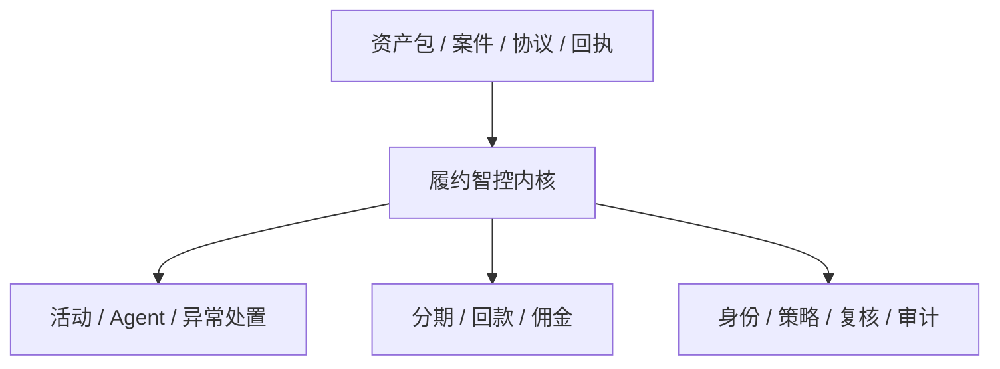
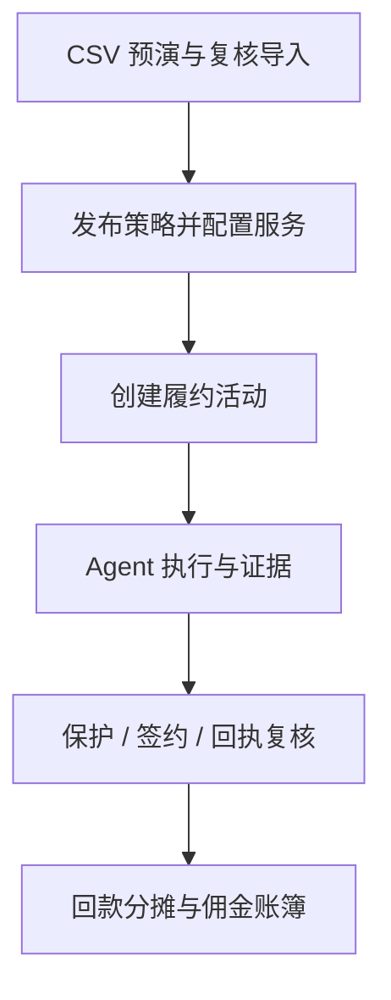
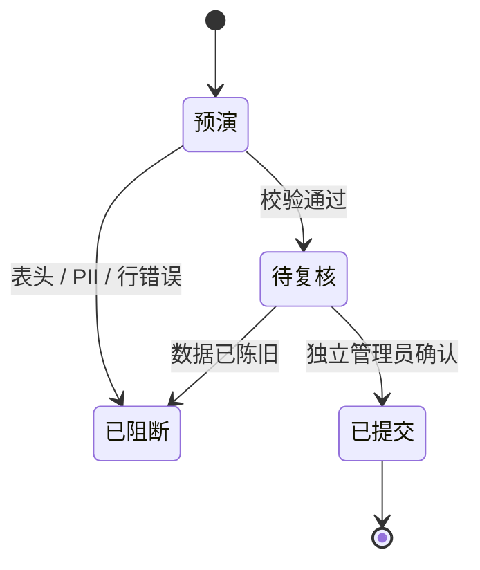
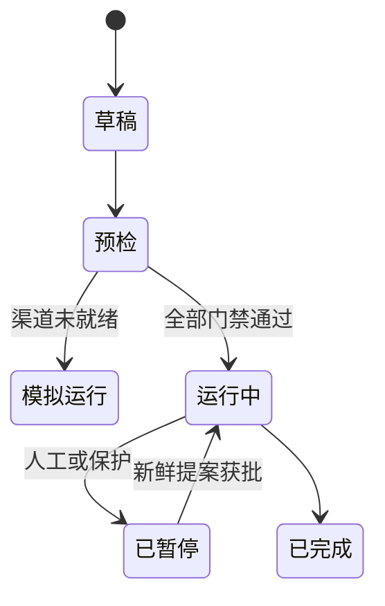
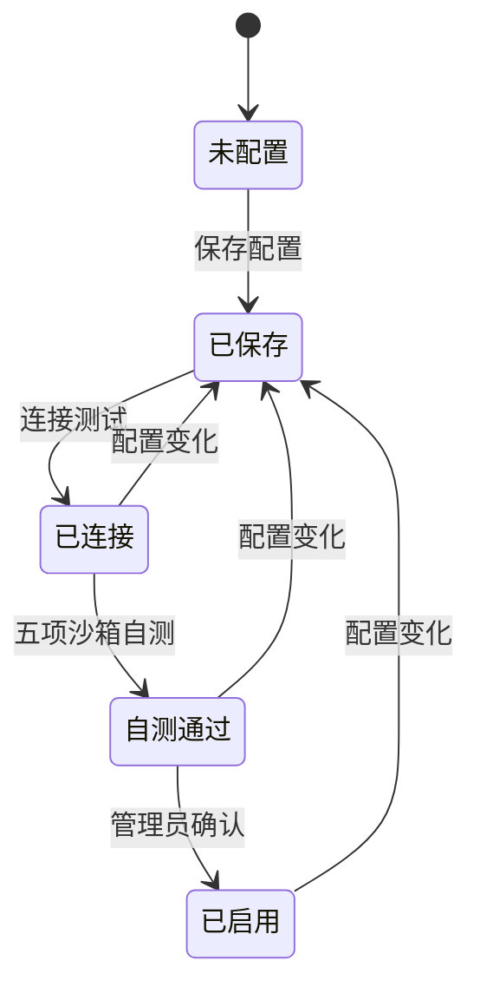
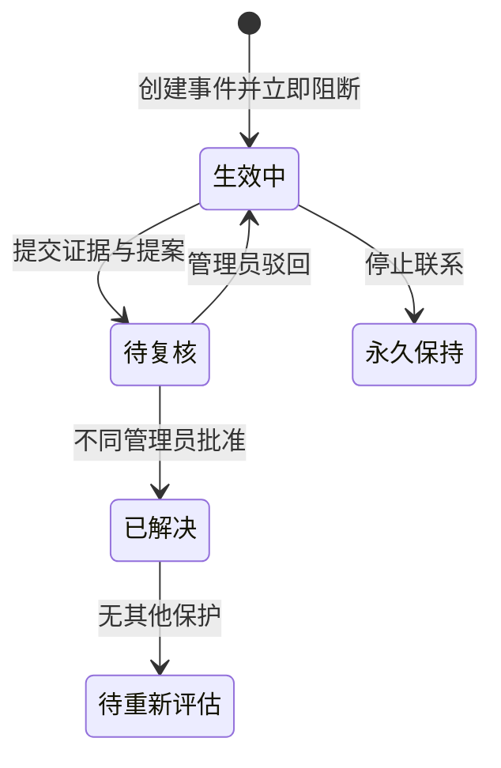
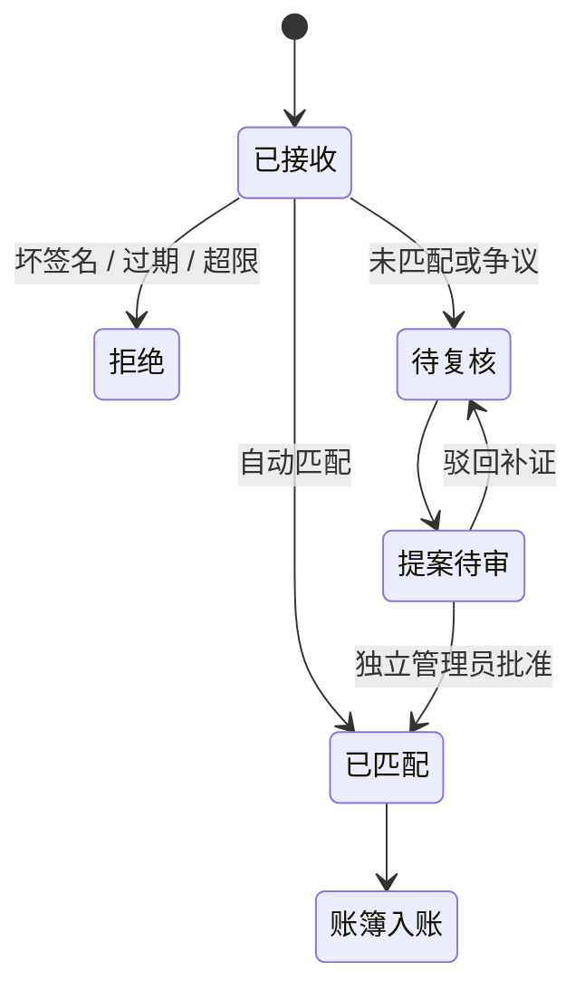

# 履约智控 AI · RepayGuard AI 产品功能规格

| 文档版本 | 更新日期 | 适用对象 | 状态 |
|---|---|---|---|
| `v0.15.0` | 2026-09-15 | 产品、研发、测试、交付、合规、运营 | 与 `main` 对齐 |

## 1. 产品卡片

| 项目 | 定义 |
|---|---|
| 中文名 | 履约智控 AI |
| 英文名 | RepayGuard AI |
| 品类 | 资产回款运营平台 |
| 核心用户 | 资产运营、风控、财务、合规、管理员 |
| 核心价值 | 把案件行动、保护、签约、回款和佣金放在同一条可审计证据链上 |
| AI 定位 | 查询、解释、规划、提案；不越过确定性业务门禁 |
| 产品语气 | 克制、可信、可审计 |

## 2. 能力地图

| 能力域 | 用户结果 | 权威来源 |
|---|---|---|
| 经营总览 | 看清规模、回款、佣金、自动化和异常 | 服务端指标与账簿 |
| 数据导入 | 预演、纠错、复核并幂等接入资产与案件 | Asset Import Batch |
| 资产与案件 | 管理委托范围、单案状态和下一步 | Tenant / Package / Case |
| 履约活动 | 在策略、预算和渠道门禁内批量运营 | Activity + 服务快照 |
| AI 与 Agent | 查询事实、解释原因、生成待审动作 | Gateway + 工具轨迹 |
| 保护与异常 | 立即阻断不安全动作并留存复核证据 | Protection Incident |
| 履约计划 | 管理签约方案、期次和余额 | Repayment Plan |
| 回款与佣金 | 验签、对账、分摊、退款、计佣 | 不可变账簿 |
| 平台治理 | 管理成员、Provider、任务、密钥和审计 | RBAC + Job + Audit |

## 3. 角色与职责

| 能力 | 观察员 | 运营人员 | 管理员 | 系统 / Worker |
|---|---:|---:|---:|---:|
| 查看案件、活动、指标 | ✓ | ✓ | ✓ | 按任务 |
| 使用 ChatBI 查询 | ✓ | ✓ | ✓ | — |
| 创建活动或行动提案 | — | ✓ | ✓ | 确定性任务 |
| 创建回执/保护/方案提案 | — | ✓ | ✓ | 仅候选建议 |
| 复核他人提案 | — | — | ✓ | — |
| 配置并启用 Provider | — | — | ✓ | 执行测试 |
| 确认结算与实收 | — | — | ✓ | — |
| 直接写回款/佣金账簿 | — | — | — | 账务内核 |
| 通用解除停止联系保护 | — | — | — | — |

> Maker–Checker：提案人与复核人必须是不同账号；角色只从数据库租户成员关系解析。

## 4. 业务主链

### 4.1 资产与案件导入

| 控制点 | 规则 |
|---|---|
| 文件 | UTF-8 CSV，最大 1 MB、1000 行 |
| 字段 | 仅接受 v1 白名单；姓名、号码、证件、地址和邮箱字段整批阻断 |
| 金额 | 只接受整数分，范围 `1–1,000,000,000` |
| 委托 | ISO 日期、开始不晚于截止、已过期委托不能进入普通可运营池 |
| 联系依据 | 只保存安全证据引用，不保存联系方式正文 |
| 重复 | 文件内重复为错误；库内已有案件跳过且永不覆盖 |
| 幂等 | `tenant_id + idempotency_key`；同键异文件拒绝 |
| 提交 | 创建人与确认人分离，提交前重新检查案件、资产包和佣金规则 |
| 落库 | 资产包、规则、案件、财务档案、批次和审计同一事务提交 |
| 策略 | 新资产包默认为草稿，不自动获得生产触达资格 |
| 留存 | 保存 SHA-256、标准化非敏感行和问题，不保存原始 CSV |

### 4.2 创建活动

| 预检项 | 失败结果 |
|---|---|
| 租户、资产包和案件归属 | 拒绝创建 |
| 保护、完成、重复运行状态 | 排除或阻断 |
| 目标与案件状态 | 拒绝不匹配目标 |
| 预算与策略上限 | 拒绝越额 |
| 策略是否发布 | 拒绝生产活动 |
| Agent、模型、语音、电话快照 | 降级为纯模拟或阻断 |

### 4.3 AI 与 Agent

| 可以 | 不可以 |
|---|---|
| 查询案件、策略、活动、运行、运营与钱指标 | Shell、任意文件系统、任意 HTTP |
| 解释结论并显示来源 | 把模型文本当成业务事实 |
| 生成暂停/恢复等结构化提案 | 直接触达、改账、解除保护、发布策略 |
| 使用持久会话与受控工具 | 绕过租户、权限、状态或提案新鲜度 |

Provider 进程存活时复用 Session；重启后只重放有限脱敏检查点，涉及业务事实必须重新调用工具。

### 4.4 Provider 启用

配置保存、连接测试、全链路自测、生产启用是四个独立动作；任何配置变化都会使旧报告和启用状态失效。

### 4.5 保护事件

| 规则 | 结果 |
|---|---|
| 打开保护事件 | 案件与相关活动立即阻断 |
| 委托到期 | 必须提交续期授权证据 |
| 批准解除 | 只进入“待重新评估”，不恢复旧活动 |
| 仍有其他保护 | 案件继续阻断 |
| 停止联系 | 无通用解除入口 |

### 4.6 履约计划

| 门禁 | 规则 |
|---|---|
| 协议证据 | 只保存外部引用与 SHA-256 摘要，不保存正文 |
| 金额 | 不超过已核验债权余额 |
| 资产政策 | 满足最低结算、最低首付和最大期数 |
| 时间 | 不超过委托有效期，期次连续 |
| 案件状态 | 保护案件不能创建方案 |
| 生效 | 独立管理员按最新版本与政策复核 |
| 分摊 | 已验签回款按最早到期期次优先 |
| 退款 | 只逆冲原回款分摊，从最新期次回退 |

### 4.7 支付、对账与账簿

| 控制点 | 规则 |
|---|---|
| 币种 | 仅 CNY |
| 签名 | 精确原始请求体 + `HMAC-SHA256 v1` |
| 时间窗 | 60–900 秒；生产建议 300 秒 |
| 幂等键 | `tenant_id + provider + provider_event_id` |
| 重放 | 同载荷只增加重复计数；冲突载荷返回 409 |
| 待复核回执 | 不进入钱指标 |
| 候选案件 | 只是确定性建议，不是入账授权 |
| 账簿 | 回款与佣金事件不可变，原子提交 |

钱指标口径：

| 指标 | 计算 |
|---|---|
| 确认净回款 | 已匹配支付 − 退款 |
| 计佣回款 | 满足委托与规则的净回款 |
| 应计佣金 | 计佣回款 × 版本化佣金规则 |
| 确认结算 | 管理员确认且不超过未结应计 |
| 实际收佣 | 管理员确认且不超过已结未收 |

## 5. 核心对象

| 对象 | 责任 | 不变量 |
|---|---|---|
| Tenant / Membership | 工作空间与角色 | 所有查询按 `tenant_id` 隔离 |
| Asset Import Batch | CSV 预演与提交证据 | 不存原文、不覆盖、自审禁止、陈旧失败关闭 |
| Asset Package / Case | 委托范围与单案事实 | 保护状态优先于行动 |
| Activity | 批量运营任务 | 创建时冻结策略与服务快照 |
| Agent Session / Run | 对话与执行记录 | 保存工具轨迹、证据和提案 |
| Async Job | 可恢复后台任务 | 租约、心跳、尝试预算、fencing |
| Protection Incident | 风险/合规事件 | 打开即阻断，解除需独立复核 |
| Repayment Plan | 签约结果镜像 | 结构化金额/期次，不存合同正文 |
| Payment Receipt | Provider 回执 | 验签、时间窗、租户级幂等 |
| Recovery Ledger | 回款事实 | 不可变，退款引用原回款 |
| Commission Ledger | 应计/结算/实收 | 后序金额不超过前序余额 |
| Audit Event | 关键动作证据 | 主体、资源、结果与非敏感摘要 |

## 6. 部署能力

| 能力 | 前端离线 | Docker 开发 | Sites | ECS / 1Panel |
|---|---:|---:|---:|---:|
| UI 交互 | ✓ | ✓ | ✓ | ✓ |
| PostgreSQL | — | ✓ | — | ✓ |
| 服务端 RBAC | — | ✓ | — | ✓ |
| 独立 Worker | — | ✓ | — | ✓ |
| 支付验签/账簿 | 演示 | 沙箱可选 | 演示 | Provider 接入后 |
| 真实模型 | — | 显式开启 | — | 全部门禁后 |
| 真实语音/电话 | — | — | — | 仍需适配 |
| 企业 OIDC | — | 后端可测 | — | 后端具备，浏览器需 IdP 适配 |

## 7. 非功能门禁

| 维度 | 必须满足 |
|---|---|
| 安全 | 生产失败关闭、RBAC、密钥引用/信封、模型出网限制、Maker–Checker、非 root |
| 可靠性 | 作业租约与恢复、支付幂等、账务原子性、事务迁移、数据库 readiness |
| 隐私 | 不保存合同正文、原始支付体、模型原文或明文凭证 |
| 可维护性 | Python 3.12、Ruff、Pytest、Node Test、Vite、版本化文档 |
| 可追溯性 | 关键状态、工具、审批、账务与 Provider 调用均留摘要证据 |

## 8. 发布验收

| 编号 | 门禁 | 通过标准 |
|---|---|---|
| G1 | 工程验证 | `npm run verify` 全绿 |
| G2 | 数据库 | PostgreSQL 17 完整迁移与测试通过 |
| G3 | 部署 | Compose 解析和 1Panel 契约通过 |
| G4 | 默认安全 | 真实模型、支付沙箱、Harness 关闭 |
| G5 | 生产配置 | OIDC、HTTPS CORS、Runtime 密钥缺失时拒绝启动 |
| G6 | 业务保护 | 未匹配回执、保护案件、自审、陈旧版本、越额账务失败关闭 |
| G7 | 文档 | README、产品、架构、配置、运维、发布说明版本一致 |
| G8 | 凭据 | Git 中无真实密钥、数据库或原始业务数据 |
| G9 | 导入 | PII/坏行整批阻断、重放幂等、自审与陈旧提交失败关闭 |

## 9. 路线图

| 优先级 | 能力 | 完成定义 |
|---|---|---|
| P0 | 企业 IdP 浏览器登录 | Authorization Code + PKCE、刷新、退出、E2E |
| P0 | ECS 升配与验收 | 至少 2C4G/60G、HTTPS、备份恢复、容量报告 |
| P1 | 真实语音/电话 | Provider webhook、沙箱号码、失败恢复、合规验收 |
| P1 | 可观测性 | 结构化日志、Request ID、指标、告警、SLO |
| P1 | 浏览器 E2E | 登录、活动、保护、对账、履约主路径 |
| P2 | 领域拆分 | 后端 Router/Service/Repository 与前端领域 Store |
| P2 | 数据库强化 | 复合租户外键、Check Constraint、统一分页 |

## 10. 明确非目标

- 不内置真实银行、支付、电话或邮件账号。
- 不让聊天直接拨号、发消息、发布策略、解除保护或改账。
- 不把沙箱测试描述成真实 Provider 已接通。
- 不在当前 ECS 模板中运行本地大模型。
- 不把 Sites 静态演示描述成完整业务部署。
