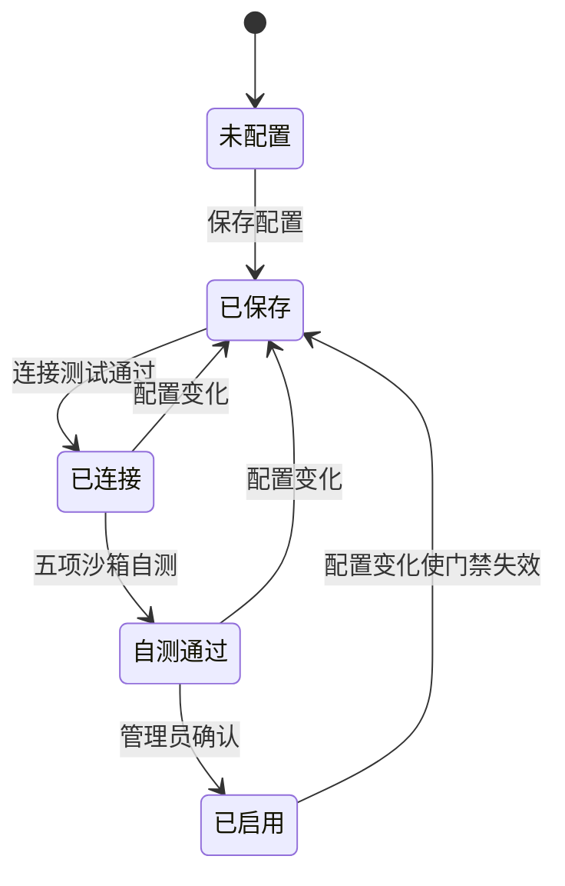
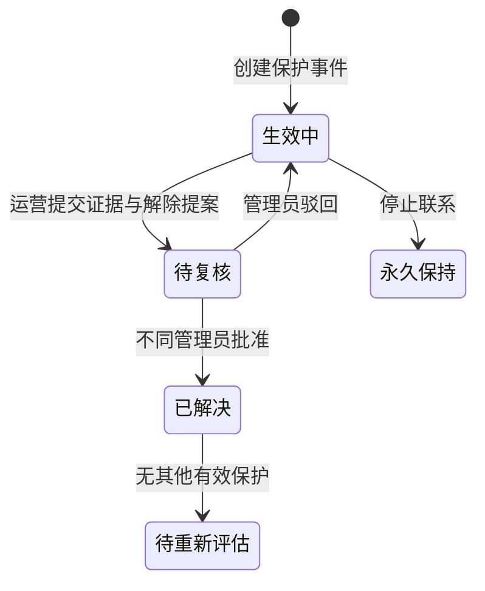
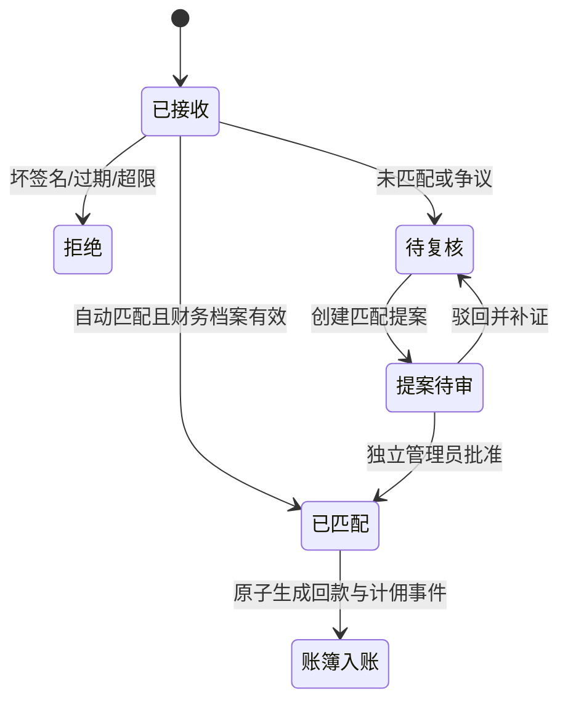

# 履衡 AI · FulfillOps Cloud 产品功能规格

文档版本：`v0.13.0`  
更新日期：2026-09-15  
适用对象：产品、研发、测试、交付、合规与运营

## 1. 产品定义

履衡 AI 是面向资产履约与回款运营的多租户工作空间，统一管理资产包、案件、策略、运营活动、Agent 运行、保护事件、履约计划、支付回执、回款与佣金证据。

产品的关键差异不是“让大模型自动催收”，而是把 AI 放入受控业务系统：

- AI 查询和解释服务端事实；
- AI 可以生成行动草案或复核建议；
- 权限、策略、保护状态、预算、账务和 Maker–Checker 流程决定动作能否发生；
- 高影响操作必须由结构化流程确认，不能由聊天直接执行。

## 2. 当前范围与非目标

### 2.1 当前范围

- 多租户工作空间与数据库成员 RBAC；
- 资产包、案件、策略和运营活动；
- Agent Gateway、持久会话、受控工具和异步任务；
- AI/模型/语音/电话接入配置、自测和启用门禁；
- 保护事件与证据约束的复核处置；
- 签约方案、分期期次、回款分摊和退款冲销；
- 支付回执验签、幂等、对账和不可变财务账簿；
- 模型安全回放、Token 与保守费用审计；
- 本地开发、Sites 前端演示和 ECS/1Panel 生产模板。

### 2.2 非目标

- 不内置真实银行、支付机构、电话运营商或邮件供应商账号；
- 不让聊天直接拨号、发消息、发布策略、解除保护或改账；
- 不把沙箱连接测试描述为真实 Provider 已接通；
- 不保存合同正文、原始支付请求体、模型原文或明文凭证；
- 不在 ECS 上运行本地大模型；
- 不把 Sites 静态演示视为完整业务部署。

## 3. 角色与权限

| 能力 | 观察员 | 运营人员 | 管理员 | 系统/Worker |
|---|---:|---:|---:|---:|
| 查看工作空间、案件、活动、指标 | 是 | 是 | 是 | 按任务 |
| 使用 ChatBI 只读查询 | 是 | 是 | 是 | 否 |
| 创建活动或行动提案 | 否 | 是 | 是 | 仅确定性任务 |
| 创建回执匹配提案 | 否 | 是 | 是 | 候选建议 |
| 创建保护解除提案 | 否 | 是 | 是 | 否 |
| 创建履约方案提案 | 否 | 是 | 是 | 否 |
| 复核他人的提案 | 否 | 否 | 是 | 否 |
| 配置并启用 Provider | 否 | 否 | 是 | 执行测试 |
| 确认结算与实收 | 否 | 否 | 是 | 否 |
| 直接写回款/佣金账簿 | 否 | 否 | 否 | 账务内核 |
| 解除停止联系保护 | 否 | 否 | 无通用入口 | 否 |

提案人与复核人必须是不同账号。角色只从数据库成员关系解析，身份令牌不能自行声明更高权限。

## 4. 核心业务对象

| 对象 | 说明 | 关键约束 |
|---|---|---|
| Tenant | 独立工作空间 | 所有业务查询必须带 `tenant_id` |
| User / Membership | 用户与租户内角色 | 用户可以属于多个租户，角色按租户解析 |
| Asset Package | 资产包和履约政策 | 保存策略版本、预算、结算与分期约束 |
| Case | 单个资产案件 | 可被保护事件阻断，关联财务档案和方案 |
| Activity | 一组案件的运营活动 | 创建时冻结策略与服务快照 |
| Agent Session / Run | 持久对话与执行记录 | 保存工具轨迹、来源、证据与提案 |
| Protection Incident | 风险或合规保护事件 | 打开即阻断，解除需证据和独立复核 |
| Repayment Plan | 外部签约结果的服务端镜像 | 只保存引用和摘要，不保存合同正文 |
| Payment Receipt | Provider 回执 | 验签、时间窗、租户内幂等 |
| Recovery Ledger | 回款事实 | 不可变事件，退款引用原回款 |
| Commission Ledger | 佣金应计/结算/实收 | 结算和实收受前序余额约束 |
| Async Job | 可恢复后台任务 | 租约、心跳、重试预算与协作取消 |
| Audit Event | 关键动作审计 | 记录主体、资源、结果和非敏感摘要 |

## 5. 功能模块清单

### 5.1 经营总览

**用户目标**：快速判断运营规模、回款、佣金、自动化质量和异常。

当前能力：

- 显示活动、确认净回款、计佣回款、应计佣金和保护案件；
- 查看趋势图、活动表、案件下一步和运营事件；
- 按当前工作空间过滤，不跨租户汇总；
- API 在线时读取服务端账簿，离线时明确标注演示数据。

### 5.2 资产包与策略

**用户目标**：定义哪些案件可处理、预算上限和履约方案约束。

当前能力：

- 资产包列表、案件数量、余额和策略状态；
- 策略草稿与发布版本；
- 触达时段、频次、重试、语气、目标和预算；
- 最低结算比例、最低首付比例、最大分期期数；
- 活动创建时冻结策略版本，后续策略更新不追溯修改已有活动。

限制：当前策略编辑主要服务演示交互，完整的服务端策略版本仓储仍需进一步独立化。

### 5.3 案件工作台

**用户目标**：查看单案事实、保护状态、方案、回款和执行证据。

当前能力：

- 按编号、资产包和状态搜索筛选；
- 案件抽屉显示概览、回款和服务端履约计划；
- 保护案件明确显示阻断原因；
- 已验签回款和期次分摊驱动履约状态，不以页面按钮伪造到账。

### 5.4 清收活动

**用户目标**：创建受政策约束的一批案件运营任务。

创建前预检：

1. 当前租户和资产包存在；
2. 案件属于当前资产包；
3. 排除保护、已完成和已在运行中的案件；
4. 目标与案件状态匹配；
5. 预算不超过策略上限；
6. 策略已发布；
7. Agent、模型、语音和电话的版本、自测与启用状态有效。

渠道门禁不满足时只允许纯模拟活动，不能创建生产触达活动。

### 5.5 履衡 AI 与 Agent 运行

**用户目标**：以自然语言查询业务事实、理解运行原因并生成可审阅动作。

当前能力：

- 全局查询案件、策略、任务、运行、运营指标和钱指标；
- 活动内持久会话、执行阶段、证据和下一步；
- 暂停/恢复先生成结构化提案；
- 确认时重新校验租户成员、角色、活动状态和提案新鲜度；
- Provider 进程存活时续接 Session，重启后从有限数据库检查点重放；
- 保存会话、工具轨迹、来源和执行摘要。

受控工具包括案件、活动、指标、策略、知识和运行只读查询，以及活动暂停/恢复提案。禁止 Shell、任意文件系统、任意 HTTP、直接改账、解除保护和发布策略。

### 5.6 AI 与渠道接入

**用户目标**：按租户独立接入 Agent Runtime、模型、语音和电话。

每个服务都经过以下生命周期：

“保存成功”不代表 Provider 可用，“沙箱自测通过”也不代表真实外部调用完成。

### 5.7 异步任务与 Worker

**用户目标**：让连接测试、自测和 Agent 运行可以断线恢复、失败重试和审计。

当前能力：

- API 入队、独立 Worker 消费；
- PostgreSQL `SKIP LOCKED` 并发领取；
- 作业所有者、租约过期、心跳和最大尝试次数；
- 过期租约恢复、遗留 Agent Run 收口；
- 运行中取消在处理器安全边界协作完成；
- PostgreSQL 通知低延迟唤醒，轮询恢复丢失通知。

### 5.8 保护事件与异常处置

**用户目标**：在债务异议、停止联系、身份冲突、委托到期等情况下立即停止不安全动作。

规则：

- 打开事件时立即阻断案件及相关活动；
- 委托到期必须提供续期授权证据；
- 批准解除只进入“待重新评估”，不恢复旧活动；
- 仍存在其他保护事件时案件继续阻断；
- 停止联系保护没有通用解除入口。

### 5.9 履约计划与分期

**用户目标**：把外部签约事实转换为可追踪的服务端方案和期次。

规则：

- 提案只保存外部协议引用、SHA-256 摘要和结构化金额/期次；
- 方案总额不能超过已核验债权余额；
- 必须满足资产包最低结算、最低首付、最大期数和委托有效期；
- 期次编号连续且金额合计等于方案总额；
- 保护案件不能创建新方案；
- 独立管理员在批准时重新验证当前策略和版本；
- 同案不能同时存在多个生效方案；
- 已验签回款按最早到期期次分摊；
- 退款只逆冲原回款产生的分摊，并从最新期次开始回退。

### 5.10 支付回执与对账

**用户目标**：确保每一笔钱先验签、去重和匹配，再进入业务指标。

回执约束：

- 仅接受 CNY；
- 使用精确原始请求体的 `HMAC-SHA256 v1`；
- 签名时间窗为 60—900 秒，生产建议 300 秒；
- `(tenant_id, provider, provider_event_id)` 唯一；
- 相同事件号与相同载荷只增加重复计数，不重复入账；
- 相同事件号与冲突载荷返回 409；
- 未匹配/争议回执不进入钱指标；
- 候选案件是租户内确定性建议，不是入账授权。

### 5.11 回款与佣金账簿

**用户目标**：区分现金事实、计佣资格、结算确认和实际收佣。

指标口径：

| 指标 | 定义 |
|---|---|
| 确认净回款 | 已匹配支付减去退款 |
| 计佣回款 | 满足委托和佣金规则的净回款 |
| 应计佣金 | 按版本化规则从计佣回款计算 |
| 确认结算 | 管理员确认的结算金额，不得超过未结应计 |
| 实际收佣 | 管理员确认的实际收款，不得超过已结未收 |

退款必须引用原支付，累计退款不能超过原金额，并沿用原支付的计佣资格和比例。

### 5.12 模型安全回放

**用户目标**：验证 Agent/模型能否遵守钱指标、保护状态和工具权限边界。

- `deterministic-contract`：零外部调用，验证受控 Gateway 契约；
- `live-provider`：在全部门禁满足后执行一次脱敏 JSON 安全评估；
- 数据库存储数据集摘要、输出摘要、Token、保守费用和 Provider 请求 ID 哈希；
- 不保存原始提示词、模型正文或凭证；
- 真实模式失败不自动重试，避免重复费用。

### 5.13 组织设置与审计

- 切换当前租户工作空间；
- 查看成员角色和认证模式；
- 查看服务、Worker、密钥与模型健康信息；
- 审计关键配置、提案、审批、账务和运行事件；
- 演示重置只重置浏览器交互，不删除或伪造服务端账簿。

## 6. 部署模式能力矩阵

| 能力 | 本地前端 | Docker 开发 | Sites | ECS/1Panel 生产模板 |
|---|---:|---:|---:|---:|
| UI 交互 | 是 | 是 | 是 | 是 |
| PostgreSQL 持久化 | 否 | 是 | 否 | 是 |
| 服务端 RBAC | 否 | 是 | 否 | 是 |
| 独立 Worker | 否 | 是 | 否 | 是 |
| 支付验签/账簿 | 演示 | 沙箱可选 | 演示 | Provider 接入后可用 |
| 真实模型 | 否 | 显式开启 | 否 | 全部门禁后可用 |
| 真实语音/电话 | 否 | 否 | 否 | 仍需 Provider 适配 |
| 企业 OIDC | 否 | 后端可测 | 否 | 后端具备，浏览器流程需 IdP 适配 |

## 7. 非功能要求

### 7.1 安全

- 生产配置失败关闭；
- 全请求租户隔离和数据库成员 RBAC；
- 密钥使用引用、AES-256-GCM 信封或 AWS Secrets Manager；
- API 不返回明文凭证，设置 JSON 禁止 Key/Token/Password 字段；
- 模型出网默认关闭并限制 HTTPS 目标、模型、Token 和费用；
- 高影响动作使用 Maker–Checker、版本检查和重新校验；
- 生产容器非 root、只读根文件系统、有限端口和安全响应头。

### 7.2 可靠性

- 持久任务租约、心跳、恢复和尝试预算；
- 支付事件租户级幂等；
- 账务变更原子提交；
- PostgreSQL 迁移事务执行并记录版本；
- API 就绪检查真实查询数据库。

### 7.3 可维护性

- Python 3.12、Ruff lint/format、Pytest；
- Node.js 22、Node Test Runner、Vite 生产构建；
- CI 验证 PostgreSQL 17 增量升级、全部测试和部署契约；
- 稳定文档与版本发布说明分离。

## 8. 验收清单

一次可发布候选至少满足：

1. `npm run verify` 通过；
2. GitHub Actions 在 PostgreSQL 17 上通过完整迁移与测试；
3. `docker compose config` 和 1Panel 生产 Compose 契约通过；
4. 真实模型、支付沙箱和 Harness 默认关闭；
5. 生产配置缺少 OIDC、HTTPS CORS、Runtime 密钥或误开开发身份时拒绝启动；
6. 未匹配回执、保护案件、自审提案、陈旧版本和越额账务全部失败关闭；
7. README、产品规格、配置参考、运维手册和发布说明与代码版本一致；
8. 发布前无真实密钥、数据库文件或原始业务数据进入 Git。

## 9. 后续产品路线

| 优先级 | 能力 | 完成定义 |
|---|---|---|
| P0 | 企业 IdP 浏览器登录 | Authorization Code + PKCE、回调、刷新、退出和 E2E |
| P0 | 目标 ECS 升配与验收 | 至少 2C4G/60G，HTTPS、备份恢复和容量报告 |
| P1 | 真实语音/电话适配 | Provider webhook、沙箱号码、失败恢复和合规验收 |
| P1 | 业务数据导入 | 服务端校验、预演、幂等导入和错误报告 |
| P1 | 可观测性 | 结构化日志、Request ID、指标、告警、SLO |
| P1 | 浏览器 E2E | 登录、活动、保护、对账和履约主路径 |
| P2 | 领域拆分 | 后端 Router/Service/Repository 与前端领域 Store |
| P2 | 数据库约束强化 | 复合租户外键、Check Constraint 和查询分页 |
